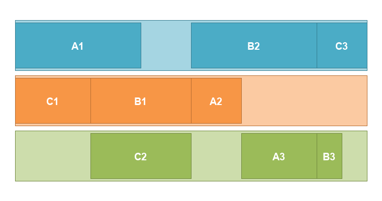
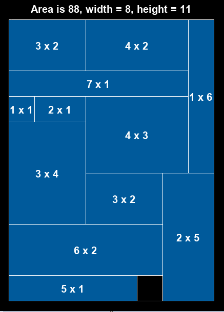
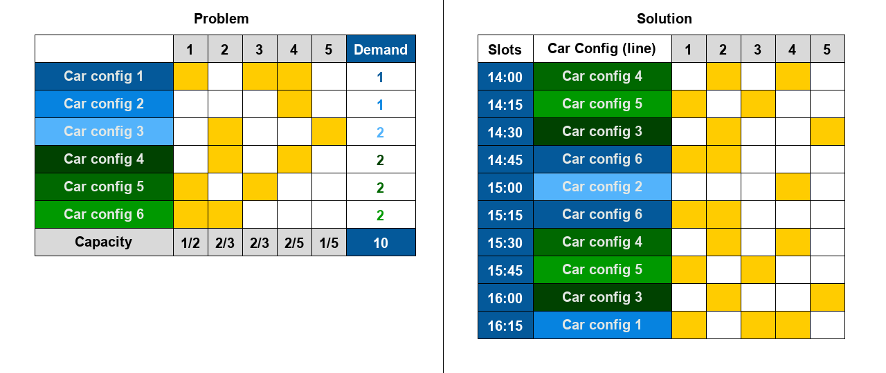

# CP-examples

This repository contains example problems and **visualizations** of different main flavors in constraint programming and discrete optimization, in general.

Its goal is to show the applicability for *classes of problems* such as scheduling-like, packing-like, etc. in analogy to what has been successfully done 
for machine learning (supervised, unsupervised, reinforcement).

## Requirements

* [MiniZinc](http://www.minizinc.org/)
* [MiniZinc-Python](https://minizinc-python.readthedocs.io/en/latest/)
* [PILlow](https://pillow.readthedocs.io/en/stable/)

## Example Problems

Each example has an associated `.mzn` file (and maybe some `.dzn` data files) and can be executed using the respective `run_xyz.py` Python file.

### [Scheduling](scheduling)

Assign tasks without overlaps and precedence requirements.

See https://www.youtube.com/watch?v=2ijSMrOFsJ8 for an explanation of the proposed model.

### [Packing](packing)
Fit as many rectangles within a square as possible. 

See https://youtu.be/2ijSMrOFsJ8?t=1518 for an explanation of the proposed model.

### [Car-Sequencing](car-sequencing)
Put cars with several options in order such that consecutive capacity constraints are respected on an assembly line.

See https://www.youtube.com/watch?v=qrWhog10PEQ for an explanation of the proposed model.

