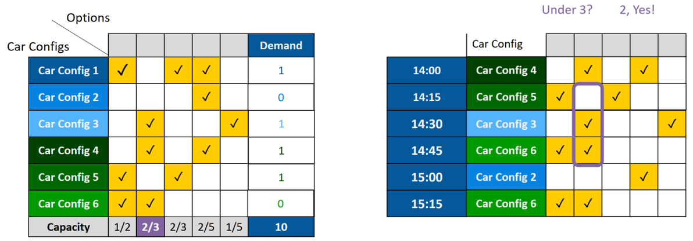

# Car Sequencing

## Idea and Problem


Given a number of car configurations with different options (e.g., moonroofs, heated seats, etc), assign to every slot in a shift a particular car such that
* the demand can be fully satisfied
* capacity constraints (e.g., at most two moonroofs per five slots) are respected

## Code
* `run_car_seq.py` runs the car sequencing problem defined in `car_seq.mzn`

### Output:


## Variables and Parameters 


### Parameters
```
% parameters for car configurations
set of int: CarConfigs = 1..6;
set of int: Options = 1..5;

array[CarConfigs] of int: demand;
int: nCars = sum(c in CarConfigs) (demand[c]);
array[CarConfigs,Options] of 0..1: requires;
```

### Variables
```
int: nSlots = nCars; 
set of int: Slots = 1..nSlots; 

% actual decision variables
array[Slots] of var CarConfigs: line;
array[Slots,Options] of var bool: setup;
```

## Constraints

### Tying `setup` to `line`


```
% tie setup to the requires matrix constraint 
  forall (s in Slots, o in Options) (	setup[s,o] = requires[line[s],o]
);
```
### Match the demand
```
% we produce what is ordered
constraint forall(c in CarConfigs) (
	count(line, c) = demand[c]
);
```

### Respect capacities



```
% within per_slots slots, only at_most may require that option
array[Options] of int: at_most; 
array[Options] of int: per_slots;

constraint 
  forall (o in Options,
          s in 1..nSlots - per_slots[o] + 1)(
    sum(s_ in s .. (s + per_slots[o]-1) ) (setup[s_,o])
    <= at_most[o]); 
```

## Objective
Just find a satisfying arrangement (could be other goals if we allowed breaks).

```
solve satisfy;
```