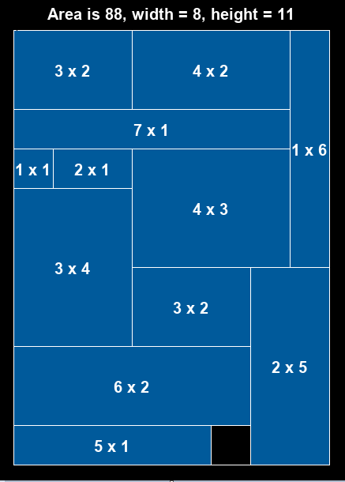

# Packing (2D)

## Idea and Problem


Given a number of shapes, place them onto a rectangle such that 
* no shapes overlap 
* the needed area is as small as possible

## Code
* `run_rect_packing.py` runs the rectangle version of the problem
* `run_square_packing.py` runs the (simpler) square packing version

### Output:



## Variables and Parameters 


```
int: n; % number of shapes
set of int: SHAPES = 1..n; 
array[SHAPES] of int: widths;
array[SHAPES] of int: heights; 

array[SHAPES] of var int: x; 
array[SHAPES] of var int: y;
```

## Constraints

### Non-overlap

```
constraint forall(s1, s2 in SHAPES where s1 != s2) (
	x[s1] + widths[s1] <= x[s2] \/
	x[s2] + widths[s2] <= x[s1] \/
	y[s1] + heights[s1] <= y[s2] \/
	y[s2] + heights[s2] <= y[s1] 
);
```

### Within boundaries
```
constraint forall(s in SHAPES) (x[s] + widths[s] <= sq_width);
constraint forall(s in SHAPES) (y[s] + heights[s] <= sq_height);
```

Other declarations in the model just make sure that the domain bounds are somewhat tight.

## Objective


Minimize the needed area (tied with the boundaries constraint above):
```
int: minArea = 
  sum(i in SHAPES) (widths[i]*heights[i]);
int: maxArea = max_width_square*max_height_square;
var minArea .. maxArea: area ;

constraint area = sq_height * sq_width;
solve minimize area;
```