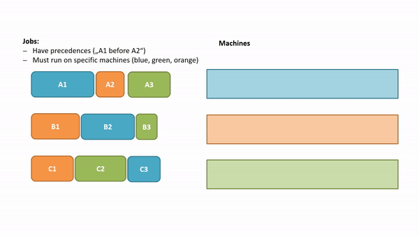
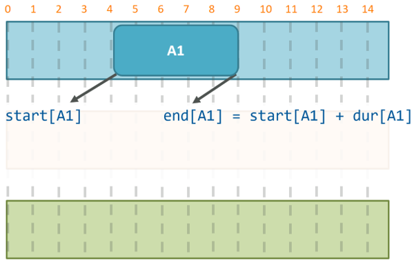
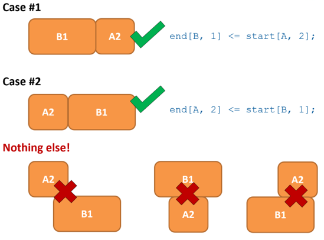
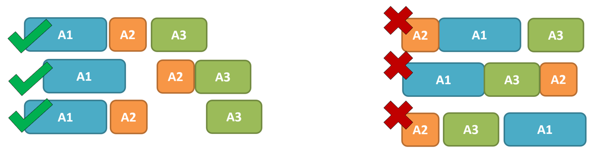
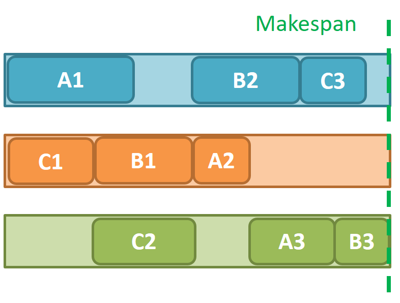

# Scheduling (Job-Shop)

## Idea and Problem

  

Given a number of jobs that each have the same number of tasks,
find start times for them such that 
* no tasks that require the same machine overlap 
* tasks within a job respect the given order (precedences, job A2 can start only after A1 has finished)
* the overall makespane is minimized

## Code
* `run_scheduling.py` runs the problem

### Output:


## Variables and Parameters 

 

```
int: lastT = 14;
set of int: TIME = 0..lastT;

enum JOBS = {A, B, C};
set of int: TASKS = 1..3;

array[JOBS,TASKS] of int: dur =  [| 5, 2, 3 | 4, 5, 1 | 3, 4, 2 |];

% actual decision variables
array[JOBS,TASKS] of var TIME: start;
array[JOBS,TASKS] of var TIME: end;

constraint forall(j in JOBS, t in TASKS)(
  end[j,t] = start[j,t] + dur[j,t]
);
```

## Constraints

### Non-overlap

```
constraint
  forall(j1, j2 in JOBS, t1, t2 in TASKS where
         j1 != j2 
      /\ taskToMach[j1, t1] = taskToMach[j2, t2]) (
                  end[j1, t1] <= start[j2, t2] \/
                  end[j2, t2] <= start[j1, t1]
      );  
```

### Precedences

```
% precedences
constraint forall(j in JOBS, t in 1..max(TASKS)-1) (
 end[j, t] <= start[j, t+1]
);
```

## Objective
 

Minimize the time of the last finished job:
```
% objective
var TIME: makespan; 
constraint makespan = 
  max(j in JOBS, t in TASKS)(end[j,t]);

solve minimize makespan;
```